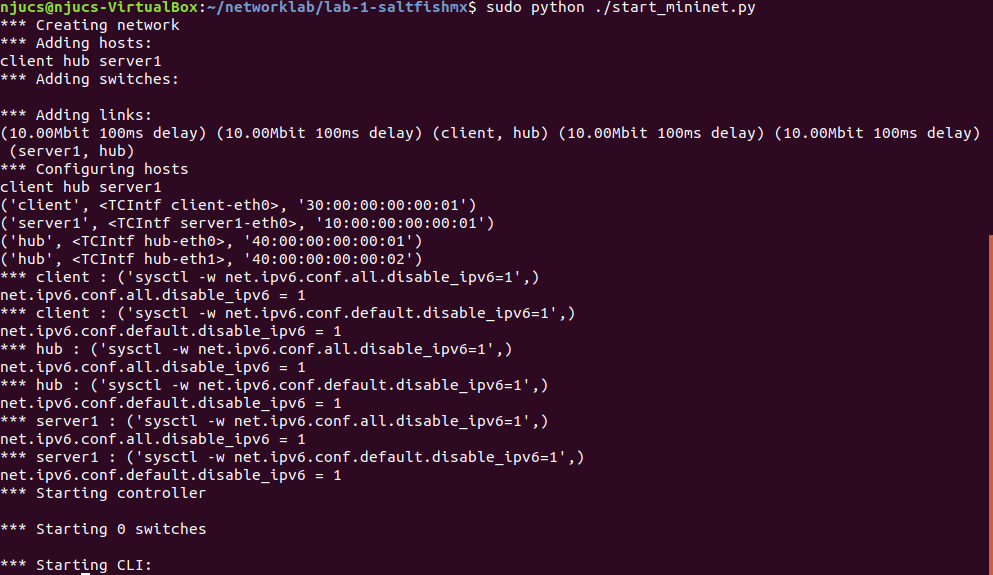
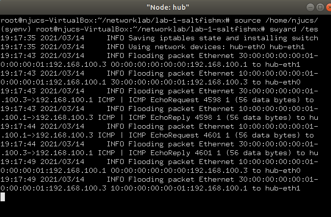
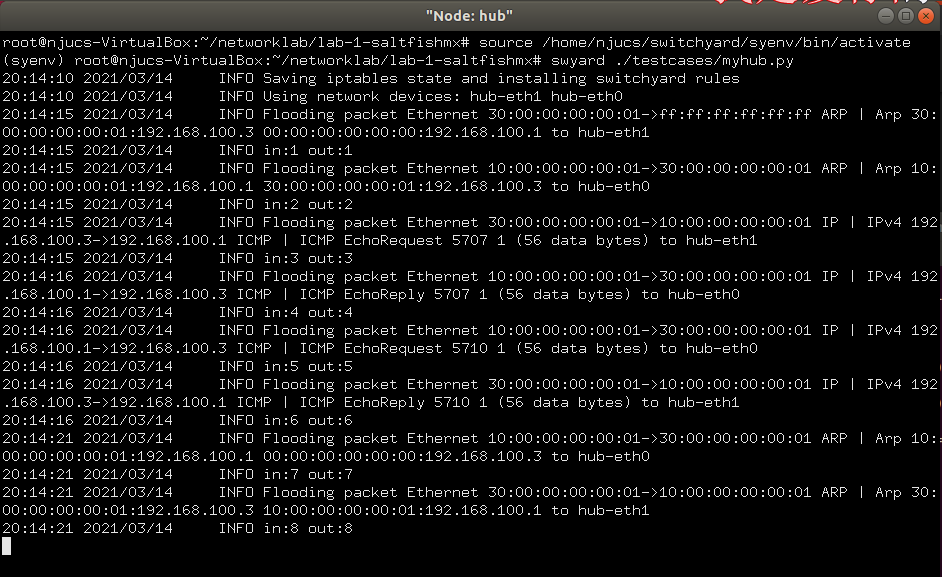
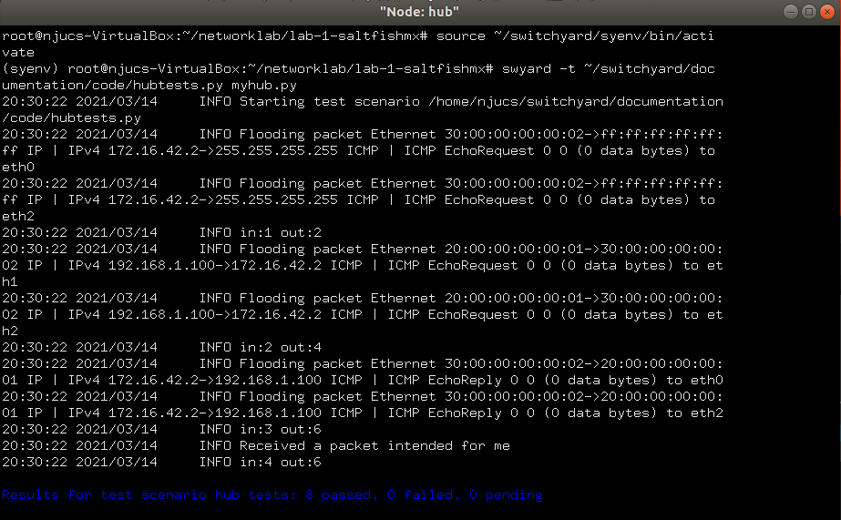
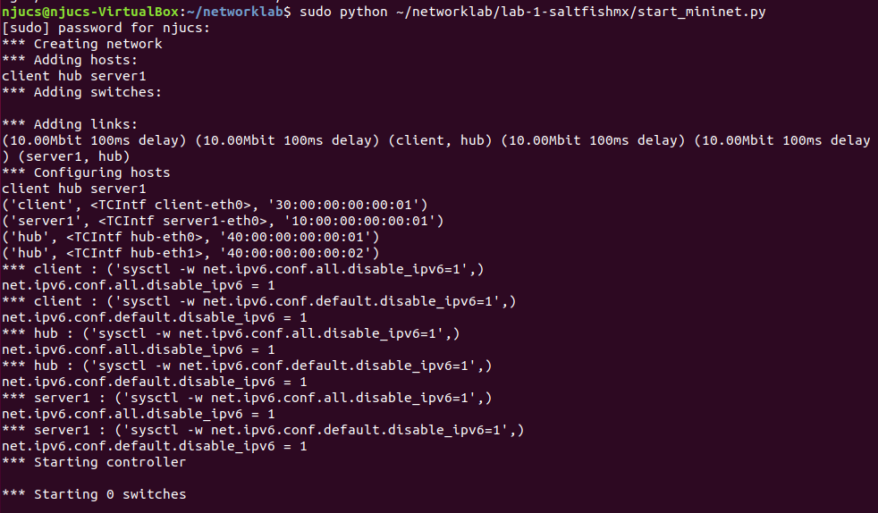
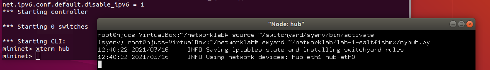
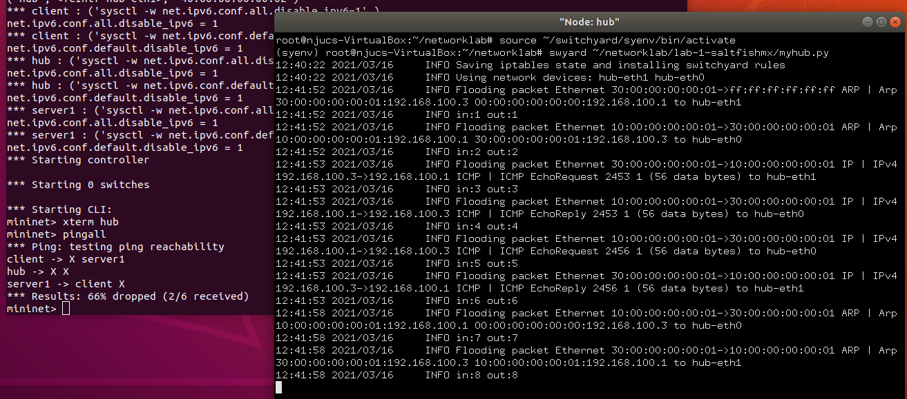
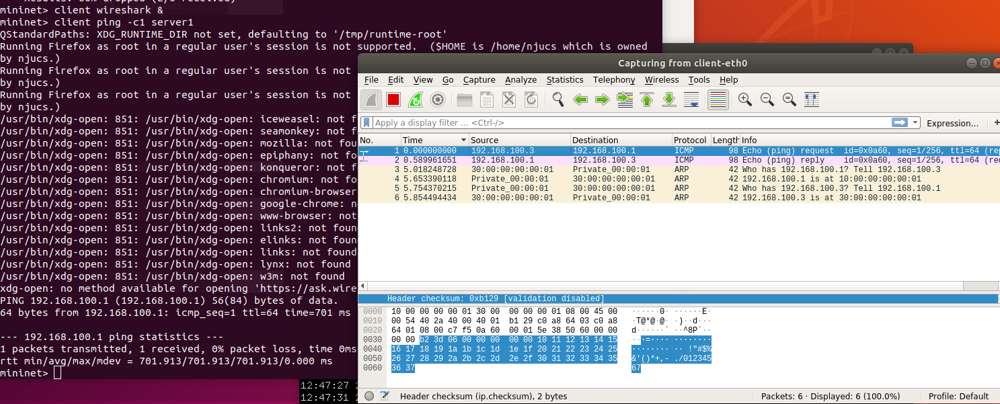
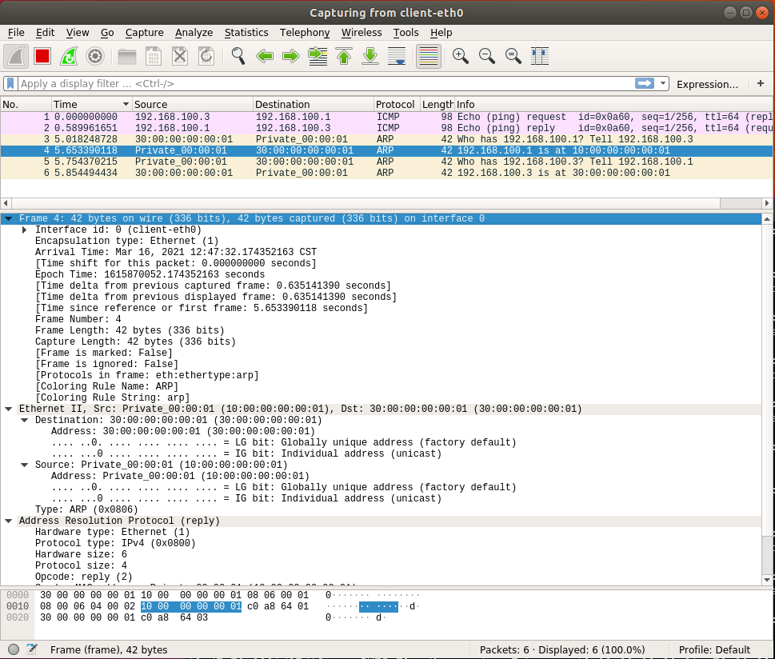
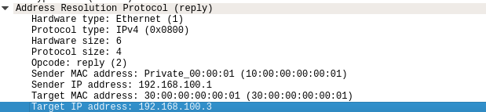

# **Lab 1: Switchyard & Mininet**
#### <p align="right">181180050 孔孟荀</p>
---
### step1  Modify the Mininet topology

选择做 Delete server2 in the topology

分析一下原来的要修改的文件start_mininet.py，发现它定义了一个nodes，里面有包括
server2在里面的各种节点，应该只要把server2的部分直接注释掉就行
```
nodes = {
    "server1": {
        "mac": "10:00:00:00:00:{:02x}",
        "ip": "192.168.100.1/24"
    },
    #"server2": {
    #    "mac": "20:00:00:00:00:{:02x}",
    #    "ip": "192.168.100.2/24"
    #},
    "client": {
        "mac": "30:00:00:00:00:{:02x}",
        "ip": "192.168.100.3/24"
    },
    "hub": {
        "mac": "40:00:00:00:00:{:02x}",
    }
} 
```
 
 用mininet看一下现在的拓扑结构，发现确实没有server2了，修改成功
 
 

 ---
 ### step2  Modify the logic of a device

注意到manual中说“In Switchyard, the device you want to be the hub will run this 
script and act like a hub by receiving any packets and forwarding to any other 
interfaces except the packets towards the hub itself. ”

再阅读myhub.py的代码，由manual里对于switchyard api的介绍，知道recv_packet()对应收包，而send_packet()对应发包，所以修改myhub.py如下
```
def main(net: switchyard.llnetbase.LLNetBase):
    my_interfaces = net.interfaces()
    mymacs = [intf.ethaddr for intf in my_interfaces]
    in_num = 0
    out_num = 0
    while True:
        try:
            _, fromIface, packet = net.recv_packet()
            in_num += 1
        except NoPackets:
            continue
        except Shutdown:
            break

        log_debug (f"In {net.name} received packet {packet} on {fromIface}")
        eth = packet.get_header(Ethernet)
        if eth is None:
            log_info("Received a non-Ethernet packet?!")
            return
        if eth.dst in mymacs:
            log_info("Received a packet intended for me")
        else:
            for intf in my_interfaces:
                if fromIface!= intf.name:
                    log_info (f"Flooding packet {packet} to {intf.name}")
                    net.send_packet(intf, packet)
                    out_num += 1
        log_info(f"in:{in_num} out:{out_num}")
    net.shutdown()
```
再没有修改之前，hub的log是这样的

修改之后：

用有发给hub的包的hubtests.py试试

可见，符合manual里说的发给hub本身的包hub不再转发给其他结点

---
###Step 3: Modify the test scenario of a device
选择做Create one test case by using the given function new_packet with different arguments

读了三个testcase以后，发现这三个testcase分别讲了这三件事：三个testcase里的包分别是1：broadcast destination 2：unicast address 3：destination is the hub itself，
hub对应的处理方式分别是 1、2：向除了入口ingress的所有port sent out packet ，3：什么事都不做
这三个testcase主要帮我理解了包的目的地和hub的出口port的区别

理解了这些事以后，选了一个很偷懒的方式来modify，只要把testcase3的destination的hub的端口eth2改成eth1，相关描述改改就行了
```
    # test case 4: a frame with dest address of one of the interfaces should
    # result in nothing happening
    reqpkt = new_packet(
        "20:00:00:00:00:01",
        "10:00:00:00:00:02",
        '192.168.1.100',
        '172.16.42.2'
    )
    s.expect(
        PacketInputEvent("eth1", reqpkt, display=Ethernet),
        ("An Ethernet frame should arrive on eth1 with destination address "
         "the same as eth1's MAC address")
    )
    s.expect(
        PacketInputTimeoutEvent(1.0),
        ("The hub should not do anything in response to a frame arriving with"
         " a destination address referring to the hub itself.")
    )    
```
---

###Step 4: Run your device in Mininet
仿照switchyard 的running in the minet的步骤
1.``  sudo python ~/networklab/lab-1-saltfishmx/start_mininet.py``

2.`` xterm hub``
3.run my hub code on it

4.pingall
here is the result:


---

###Step 5: Capture using Wireshark
capture packets on one host (no hub) while creating some traffic. Save your capture file and submit it with your report and code
共有 client server1 hub ，不能看hub
我选择看client:``client wireshark & ``
to make some traffic :``client ping -c1 server1``

使用ping之后似乎出现了一些问题，不过没有影响我wireshark抓包(大概)
mininet的提示似乎在说，我没有设置XDG_RUNTIME_DIR,然后有有关防火墙和我权限的事情，不过我没管(没看懂)
describe the details of my capture file:

以此图为例，这个包主要说了这么一些事：它的源是10：00：00：00：00：01，目的地是30：00：00：00：00：01，它的协议是arp（地址解析协议），它到达的时间是我做实验的时间21年3.16中午，
比较有趣的是它的功能，在info一栏看到它作用是回答了三号frame的问题

找了一下这段信息是怎么表达出来的，似乎应该是通过这个arp的四个地址表达出来的：


---
###收工